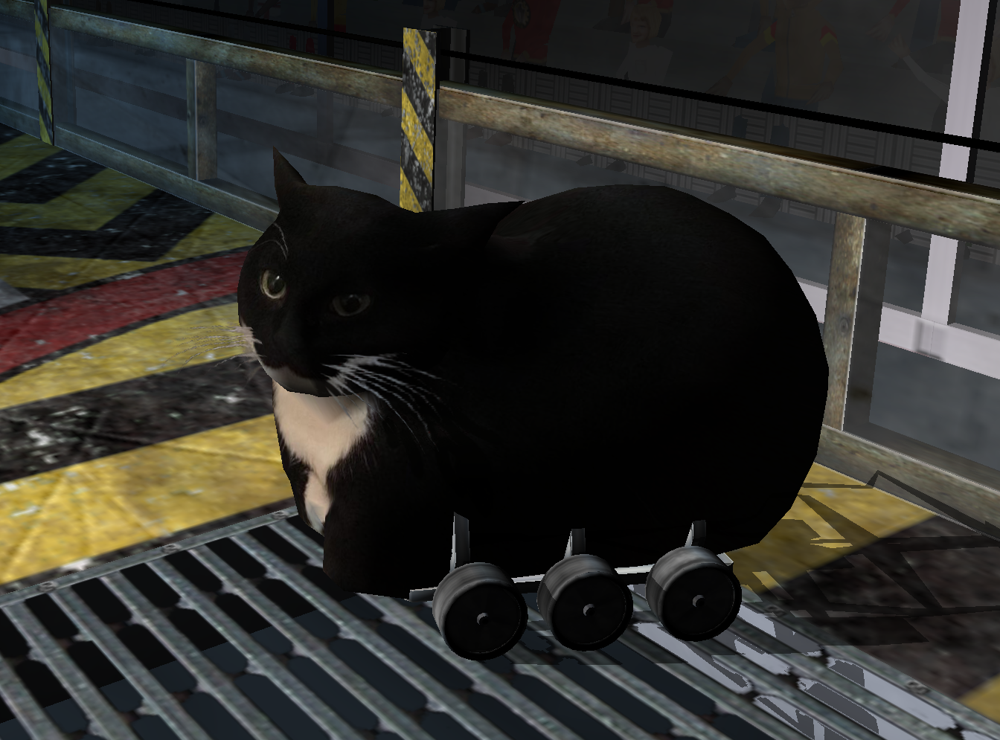
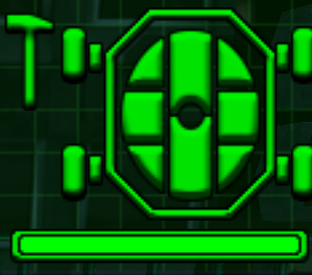

## Overview
These tools allow the unpacking and re-packing of Robot Wars: Extreme Destruction game assets on PC, as well as bidirectional conversion between the game's native mesh format and USD. This makes mods possible, including graphical ones.

For full disclosure: I used ChatGPT to help write some of the boilerplate and USD handling code in the project's early stages. For this reason, I'm releasing it under the public domain.

## Requirements
* Windows (maybe the game works with Wine/Proton, but I haven't tested it)
* Robot Wars: Extreme Destruction game files (tested with the v1.115b update)
* Python 3 (tested with 3.10; 3.7 or higher recommended)
* USD Python (`pip install usd-core`)
* RNC ProPack compression tool (https://github.com/lab313ru/rnc_propack_source)
* Not specific to these tools, but: if your monitor is >60Hz, you'll need RivaTuner (or some other frame-limiting software) in order for the AI bots to work.

## Usage/Cheat Sheet
The commands below assume rw3tools is available in your `PYTHONPATH`. Alternatively, you can simply replace `-m <module name>` with the path to the script file itself, e.g. `python Downloads\packer.py ...`.
#### To unpack:
`python -m rw3tools.packer unpack <path to lumpy.idx> <path to lumpy.dat> <output root dir of unpacked files> [--section <section name>] [--filename <file name>]`
#### To re-pack:
`python -m rw3tools.packer pack <root dir of unpacked files> <output path to lumpy.idx> <output path to lumpy.dat> [--no-compress] [--no-cache]`
#### To convert a mesh:
`python -m rw3tools.mesh <path to input mesh> [<path to output mesh>] [--mesh-type <"MSH", "SHL" or "ARE">] [--merge-vertices]`

These commands are covered in more detail in the walkthrough below.

## Walkthrough
### Unpacking
The game's assets are "packed" in a proprietary format - unpacking allows us to view and edit them as regular old files on disk.

To do this, first ensure rnc_lib.exe from the [RNC ProPack compression tool](https://github.com/lab313ru/rnc_propack_source) is in either your `PATH` or the directory you're executing the script in. In your Robot Wars installation directory, you should find two files named "lumpy.idx" and "lumpy.dat". The latter contains the data (often compressed) for all the game's assets, and the former is an index of their names, locations etc.

To start unpacking, open a shell and run the following command: `python -m rw3tools.packer unpack <path to lumpy.idx> <path to lumpy.dat> <output root dir of unpacked files> [--section <section name>] [--filename <file name>]`

Some extra detail on some of these arguments:
* **Output root directory**: This will be created if it doesn't exist already. The game's files will be extracted to subfolders in here.
* **Section name/filename**: The game's files are organised into categories which these tools refer to as "sections" and extract into their own subfolders. Using one or both of these arguments will narrow down what gets extracted to only those specified. This can be useful if you've unintentionally overwritten an extracted folder or file and want to avoid waiting for a full unpack all over again.

The process will take a minute or two to complete. It's accelerated by using all available CPU cores, so your machine may slow down a little. Once done, many of the extracted files are plain text and can provide a lot of insight into how the game works.

### Re-packing
Once you've made edits to the assets, you'll need to re-pack them into the same location as the original lumpy.idx/lumpy.dat in order to see your changes reflected in-game. First, of course, make sure the original .idx/.dat are backed up - ideally in a location where you won't accidentally overwrite them!

Then, run this command: `python -m rw3tools.packer pack <root dir of unpacked files> <output path to lumpy.idx> <output path to lumpy.dat> [--no-compress] [--no-cache]`

* **No compress**: Don't compress any files when packing. The resulting lumpy.dat will be about twice as big, but the process will be much faster and won't require RNC ProPackED.
* **No cache**: Ignore the compression cache and re-compress ALL files when packing - see the note below.

> #### A note about compression **(read this if you're not seeing your edits reflected in-game)**
> Currently, repacking always rewrites lumpy.idx and lumpy.dat in their entirety. Compressing the unpacked files while doing this takes time, so cached versions of the compressed files are stored in a ".compressed" folder next to the unpacked files to avoid having to compress again next time. Currently, the tools detect which files have changed and will need re-compression based on their modification date. If a file you've changed has an old modification date (for example, because it's a copy-paste of another unpacked file) then this change might go undetected by the packing process and you might not see it in game. There are four different ways you can fix this:
> * Update the file's modification date.
> * Delete the cached compressed version in the ".compressed" subfolder (you may need to display hidden folders in Windows settings in order to see it).
> * Specify the `--no-compress` flag above.
> * Specify the `--no-cache` flag above, though this will take much longer when re-packing.

You may see some messages about files failing to compress - this is normal, and the files will simply be included uncompressed.

You can also tell the tools to exclude a file from being packed by prepending its name with a dot, e.g. ".myfile.txt". Note that this may hide the file if you don't have "display hidden files" enabled in your Windows settings.

### Custom Robots
A major feature that re-packing enables is the possibility of fully custom robots, unrestricted by the in-game editor. Technically this is very simple, and can be worked out quite easily by browsing the various unpacked asset files, ideally starting with the plaintext .rob files in the "robots" folder. I might put a guide here later but it's probably not worth it.

However, getting them to look unique is more involved - that's where the mesh conversion ability provided by these tools comes in.

### Mesh Conversion
You'll notice that in the "Graphics" subfolder of the unpacked files are a lot of textures (.tgas) and ".rwm" files, which are the game's 3D models in their native proprietary format. Using rw3tools, we can convert these to the [USD](https://openusd.org/release/api/index.html) format to inspect how they're set up, and convert our own models from USD to RWM to use them in-game. This readme is geared towards Blender, but should be applicable to any 3D software that supports USD.

To convert or inspect a mesh file, run the following command: `python -m rw3tools.mesh <path to input mesh> [<path to output mesh>] [--mesh-type <"MSH", "SHL" or "ARE">] [--merge-vertices]`

* **Output mesh**: This is an optional argument, because you may just want to validate or view basic info about the input mesh.
* **Mesh type**: Use this to specify which kind of mesh you want to convert to, explained in more detail below (only applicable when writing to RWM).
* **Merge vertices (currently broken, I think?)**: Specifying this flag when converting from RWM to USD will use fewer vertices and allow smooth normals in modelling software, but might mess up the normals for "double-sided" geometry. I recommend merging vertices in your 3D software instead for more control.

The format you're converting to/from is deduced automatically from the file extension.

If you're familiar with USD, geometry is converted in the standard way you'd expect, with the following caveats:
* The game's up axis is Y - use Blender's "Convert Orientation" export option if necessary.
* The game uses a co-ordinate system with different handedness which is not handled by the conversion, so meshes will be flipped on a horizontal axis. This may be fixed in the future.
* Input meshes must be triangulated - Blender has an export option for this too.
* Converting RWM to USD will attempt to use the mesh's original diffuse texture if the RWM exists in its original location alongside the unpacked files. However, converting USD to RWM will only use the USD's material name, and assumes that a diffuse texture with that name will exist in-game.
* Armour meshes (i.e. those with filenames like "\<robot name>**s**.rwm") require some custom data to work with the game's damage system. More details below.

## Authoring Meshes
Meshes (.rwm files) come in several flavours, denoted by the first 3 bytes of the file:
* MSH: generic mesh for static/rigid objects e.g. props, chassis, internal components, weapons, static UI elements.
* ARE: the arena environment.
* SHL: a "shell" of armour that can deform and break into pieces.
* DMG (unsupported): destructible props that can deform and explode.
* ANM (unsupported): meshes with authored animations e.g. animated menus, crowd members.
* PRT (unsupported): particle effects, i.e. not really meshes at all.

### SHL Types and the Damage System
SHL type meshes enable the damage system essential to the game. To explain how to set up your own meshes to fulfil their requirements, let's first go over the damage system itself.

Robots' armour is split into eight "octants", which you'll already be familiar with from the in-game status UI:

As each octant takes damage, it gets crumpled and deformed.

At the same time, armour is also split into 16 "pieces", each of which can break off when they take enough damage. I'm actually not sure whether the deformation and breakable pieces are dependent on each other in any way.

To support the visual effects of these damage features, SHL meshes require some extra data, as mentioned above. These are 7 "primvars" in USD-speak, or "attributes" in Blender-speak:
* `piece_id` (integer per face): Which breakable piece this face belongs to. Each piece has its own "hitbox" inside which weapons will damage the piece; rw3tools will generate these hitboxes automatically.
* `deform_position`/`deform_normal` (vectors per vertex): An alternate "deformed" position and normal for this vertex. The vertex blends between its default position/normal and this one based on damage level. (I realise this makes more sense as a blendshape than as primvars, which might be a future change.)
* `octant_id1`/`octant_id2` (integers per vertex): The octants that this vertex matches most closely and second-most closely. These primvars work with the other two below in a similar way to skin weights on skeletal meshes (which aren't applicable to this game). Inspect the primvars on an imported mesh to get an idea for which octant IDs map to which locations.
* `octant_weight1`/`octant_weight2` (floats per vertex): How much the vertex is influenced by the damage level of the above octants. These two weights should sum to 1. 

The eight octant damage levels are combined with the four octant primvars to produce a damage level for each vertex, which is then used to blend between the default and deformed position/normal to produce the final rendered geometry.

This repo includes an example Blender scene which uses geometry nodes to generate this custom data for any mesh, albeit with a far-from-perfect result and which might not work for all meshes. 

### Locators

All supported types may include locators, which are "attachment points" with unique names signifying important locations on the mesh at which other items (weapons, components, particle effects etc.) can be placed. Converting chassis meshes (for example) to USD and inspecting them is the best way to get an idea of how locators work. In USD, they are represented by Xforms with no child prims, which can be exported from Blender using childless Empty objects.

Locators for robot components seem to follow a particular naming scheme, combining a prefix, number and sometimes a colour for each name. Here's what the prefixes seem to mean:
* `w`: Weapon
* `d`: Drives
* `lw`: Locomotion
* `ps`: Power source

## Limitations/Further Work
There are certain features I didn't implement in order to avoid scope creep and ensure I actually got the project into a usable state. I *may* get around to them later, but I wouldn't count on it. In the meantime, if you want to try yourself, the following info might be useful:

### Binary Format Stuff

#### Collision meshes
Currently, custom collision meshes (.col files) are not supported, so you'll need to duplicate an existing one. I have had a quick look at the file format though, and it looks like it starts by defining some collision pieces (each with a number of planes), and then defines faces (or something) which reference those collision pieces by index.

#### Shadows
Custom meshes currently don't cast shadows, because these tools don't write the data necessary for them. In the original files, this data appears after the ASCII marker "DYS" (for "dynamic shadows") or "STS" (for "static shadows").

#### Specular maps
These wouldn't require any more investigation of the file format; only filling in of the placeholder values (empty strings) that the tools currently write. Specular maps are referenced by texture name in the same way as diffuse maps, with an empty string meaning *no* specular map. Similar placeholder values are written for some other material attributes.

### Other Features

* Deformation as a blendshape rather than custom primvars
* Proper co-ordinate system conversion so meshes aren't "mirrored" between USD and RWM
* Decide whether to invalidate a file's compression cache based on its hash, not modified date
* A Blender addon for importing/exporting meshes rather than a manually-run script
* Arena customisation (this might actually be possible already, I just haven't tried it yet)

## License
[CC0 1.0](https://creativecommons.org/publicdomain/zero/1.0/?ref=chooser-v1)